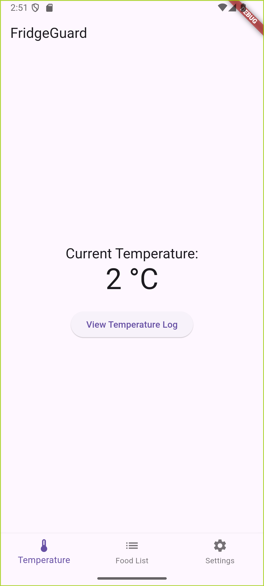
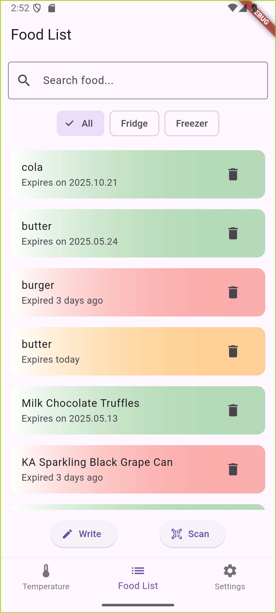
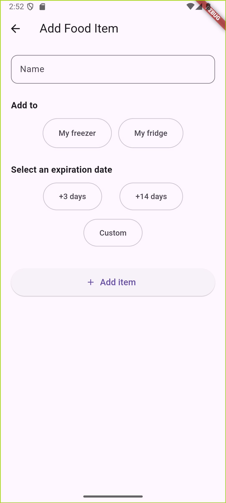
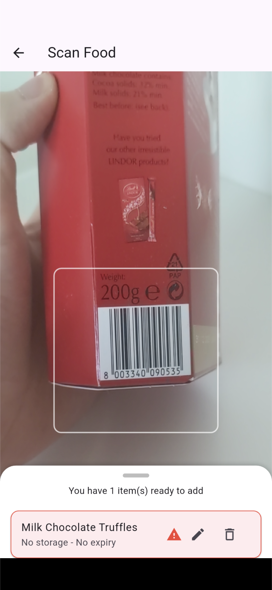
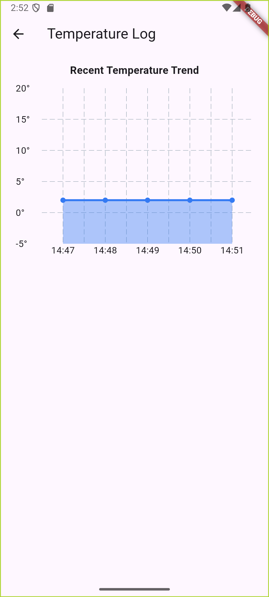
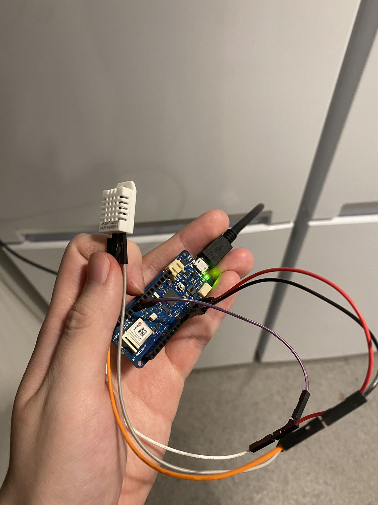
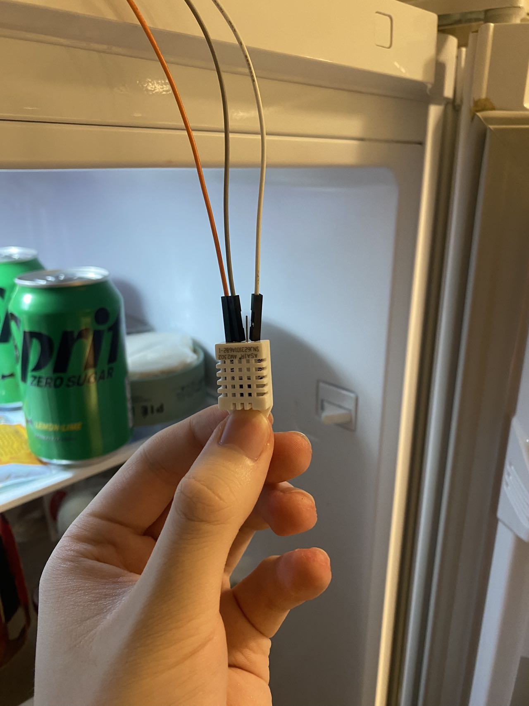
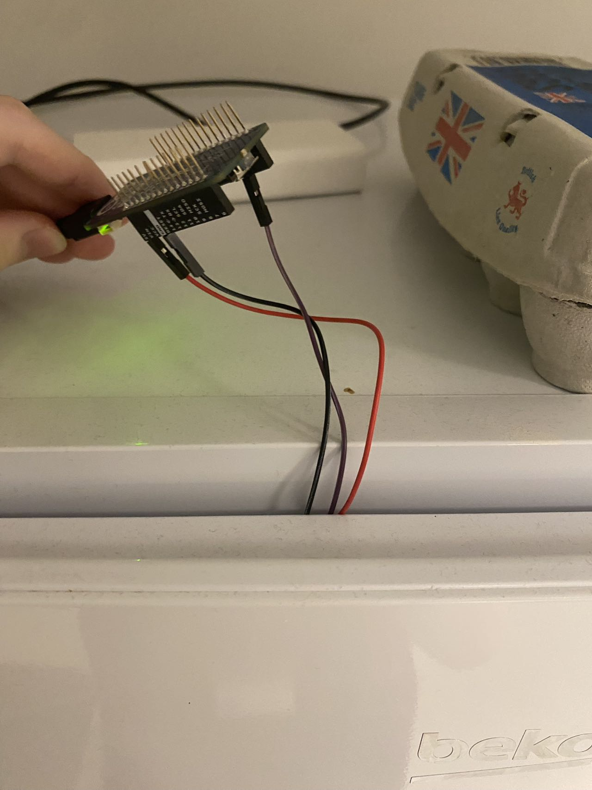

# 🧊 FridgeGuard

A smart mobile app to monitor fridge temperature and track food expiry 📱🥦  
Developed for the CASA0015 Final Assessment.

👉 [Landing Page](https://github.com/MCH0202/FridgeGuard/blob/main/landing_page/home.html)  
👉 [Presentation Video](https://github.com/MCH0202/FridgeGuard#demo-video)

---

## 🔍 Overview

**FridgeGuard** helps users:
- Track food expiry dates with color-coded reminders
- Monitor real-time fridge temperature via MQTT
- Reduce food waste and promote sustainability

---

## 📸 Screenshots

### 🏠 Home Page – Temperature Display


### 📋 Food List – Expiry Status


### ✍️ Write Page – Manual Entry


### 📷 Scan Page – Barcode Lookup


### ⚙️ Settings


---

## 🧪 Features in Action

### 👤 Register Demo


### 🌡️ Temperature Log Page


### 📦 Physical Prototype
| Front | Inside | Back |
|-------|--------|------|
|  |  |  |

---

## 🛠️ Built With

- [Flutter](https://flutter.dev/) – Cross-platform development
- [Firebase Authentication](https://firebase.google.com/docs/auth) – User login
- [Cloud Firestore](https://firebase.google.com/docs/firestore) – Food data storage
- [MQTT Protocol](https://pub.dev/packages/mqtt_client) – Real-time temperature feed
- [OpenFoodFacts API](https://world.openfoodfacts.org/data) – Barcode lookup

---

## 🎬 Demo Video

> 📺 Watch the full app demonstration in the presentation video:  
> [Link to demo in presentation](https://github.com/MCH0202/FridgeGuard#demo-video)

---

## 🚀 Installation

### Prerequisites

- Flutter SDK >= 3.10.0
- Dart >= 3.1
- Firebase CLI (for setup)

### Steps

```bash
git clone https://github.com/MCH0202/FridgeGuard.git
cd FridgeGuard
flutter pub get
flutter run
